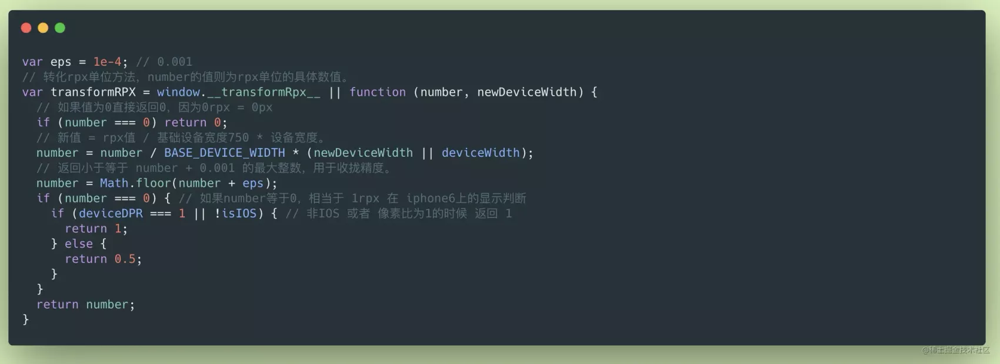
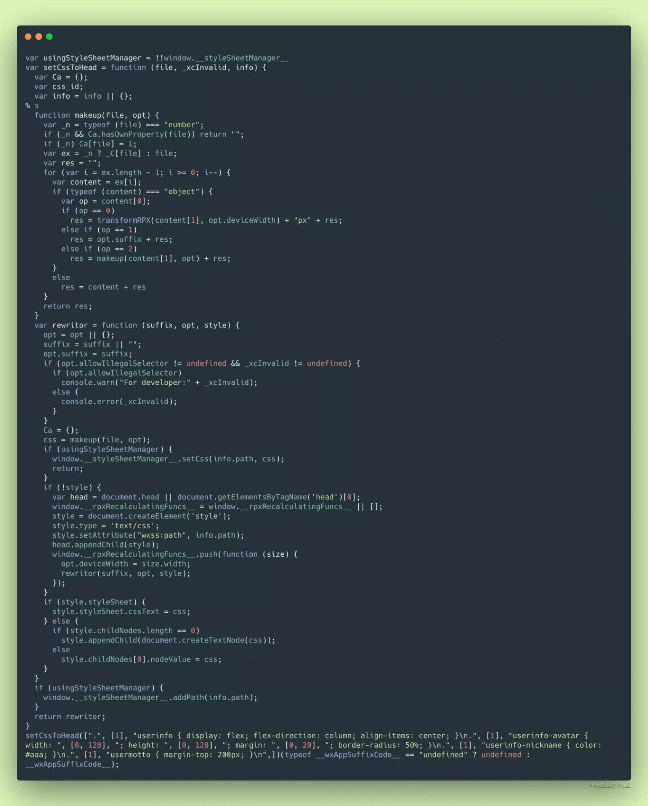

# 小程序面试题

## 小程序是双线程架构还是单线程架构？

1. 小程序的架构模型有别与传统web单线程架构，小程序为双线程架构。
2. 微信小程序的渲染层与逻辑层分别由两个线程管理，渲染层的界面使用 webview 进行渲染；逻辑层采用 JSCore运行JavaScript代码
    1. 由于渲染层与逻辑层分开，一个小程序有多个界面，所以渲染层对应存在多个webview。
    2. 这两个线程之间由Native层进行统一处理。无论是线程之间的通讯、数据的传递、网络请求都由Native层做转发。
3. 这里的webview是什么呢
    1. 可以想象webview是一个嵌入式的浏览器，是嵌入在原生应用中的
    2. webview 用来展示网页的 view 组件，使用 webkit 渲染引擎来展示，并且支持前进后退、浏览历史、放大缩小、等更多功能。
4. 并且小程序 会有 多个 webview
    1. 为了更加接近原生应用APP的用户体验。多个webview可以理解为多页面应用，有别于单页面应用SPA，SPA渲染页面是通过路由识别随后动态将页面挂载到root节点中去
    2. 如果单页面应用打开一个新的页面，需要先卸载掉当前页面结构，并且重新渲染。很显然原生APP并不是这个样子，比较明显的特征为从页面右侧向左划入一个新的页面，并且我们可以同时看到两个页面。
5. Native 主要做了什么
    1. Native层除了做一些资源的动态注入，还负责着很多的事情，请求的转发，离线存储，组件渲染等等。
    2. 界面主要由成熟的 Web 技术渲染，辅之以大量的接口提供丰富的客户端原生能力。

## 小程序中 为什么不能在 onLaunch 里面阻止页面显示 达到有必须要最先请求的 接口响应 在展示 小程序页面

1. 因为小程序是双线程架构
2. 一个线程解析 运行 js
3. 一个线程用来渲染 webview
4. 所以不像 web 端等 单线程 架构 js代码无法阻塞 webview 的展示

### 解决方案

1. 通过自定义 tab-bar  nav-bar 还有一个每个页面都在使用的 公共组件可以实现
2. 统一通过 变量所有组件默认隐藏
3. 等到接口回来再去修改这个统一变量
4. 注意边界 和容错处理 不要因为接口报错导致页面一直空白

## 小程序 view text 到底是什么 ？ 又是如何实现的 ？

1. 小程序 的 view text 标签是通过  渲染层中编译后的 Exparser 自定义组件标记
2. 会通过 $gwx() 函数 结合一些文件路径 动态数据生成 virtualDOM 虚拟dom
3. text 生成 virtualDOM   的 tag 就是 wx-text
4. view 生成 virtualDOM   的 tag 就是 wx-view

## 小程序中 为什么不能直接操作 dom 节点？

1. 为了解决安全管控问题，小程序阻止开发者使用一些浏览器提供的比如跳转页面、操作DOM、动态执行脚本的开放性接口。
2. 如果这些东西一个一个地去禁用，那么势必会进入一个糟糕的循环，因为javascript实在是太灵活了，浏览器的接口也太丰富了，很容易就遗漏一些危险的接口，而且就算是禁用掉了所有感觉到危险的接口，也势必防不住浏览器内核的下次更新。指不定又会出现一些漏洞。
3. 要彻底解决这个问题，必须提供一个沙箱环境来运行开发者的JavaScript 代码。这个沙箱环境不能有任何浏览器相关接口，只提供纯JavaScript 的解释执行环境
4. 那么像HTML5中的ServiceWorker、WebWorker特性就符合这样的条件，这两者都是启用另一线程来执行 javaScript。
5. 考虑到小程序是一个多 webView 的架构，每一个小程序页面都是不同的webView 渲染后显示的，在这个架构下不好去用某个webView中的ServiceWorker去管理所有的小程序页面。
6. 得益于客户端系统有javaScript 的解释引擎（在iOS下使用内置的 javaScriptCore框架，在安卓则是用腾讯x5内核提供的JsCore环境），可以创建一个单独的线程去执行 javaScript，在这个环境下执行的都是有关小程序业务逻辑的代码

## 小程序 是单页面应用还是多页面应用 ？  为什么 ？

1. 多页面应用  为了更好的让交互和原生 app 一样
2. 左右滑动的同时 用户可以同时看到 两个页面

## 小程序中 为什么限制了 页面栈 最多数量？

1. 因为小程序是多页面架构设计 为了更好的让交互和原生 app 一样
2. 如果不限制 页面栈 数量 就会导致性能问题 所以限制了 最大页面栈数量 防止产生过多的 webview

## 小程序中 是怎么实现 自适应 rpx  ？

rpx （responsive pixel）直译为：响应像素。写过小程序的都知道这个单位，可以自动适配所有大小的屏幕，而不必使用一些第三方插件进行响应式布局。

### 编译

WXSS并不可以直接执行在webview层进行渲染，而是通过了一层编译。我们接下来就带大家编译一个WXSS看一下。

### WCSC

编译的工具名字叫WCSC，这个编译的过程是在微信开发者工具端执行的，那么这个编译工具在哪呢，我们来找一下。在微信开发者工具的控制台界面，输入help()命令可见如所示界面。
index.wxss文件会先通过WCSC可执行程序文件编译成js文件。并不是直接编译成css文件。

### 三部分

三部分加一起就是完整的代码。
第一部分：设备信息。
这个部分用于获取一套基本设备信息，包含设备高度、设备宽度、物理像素与CSS像素比例、设备方向。
第二部分： 转换rpx
px = rpx / 基础设备宽度 750 * 设备实际宽度

### 第三部分：setCssToHead

可以看到其中在index.wxss中写rpx单位的属性都变成了区间的样子[0, 128]、[0, 20]。其他单位并没有转换。这样的话就可以方便的识别哪里写了rpx单位，然后执行第二部分的transformRPX方法即可。
makeup组装之后，创建 style 标记，插入到 head 中。
编译后的代码是通过eval方法注入执行的。这样的话完成了WXSS的一整套流程。

## 小程序 分别有 哪三种 框架 ？

### 预编译

什么是预编译的框架呢？还记得我们讲解WXSS的时候，WXSS的文件会编译成js再执行。像这种执行前就进行编译的手段就叫做预编译。这种框架就是预编译框架。wepy、taro就是这样的框架。
预编译框架的核心思想就是DSL+ 语法解析。刚看了一下taro最新的文档，已经支持react hooks这样的写法了。
小程序预编译框架的原理就如上述讲解，我们可以想象一下预编译框架的坏处有什么呢？

- react或者vue后期再出一些新特性的话，预编译框架都需要在进行语法解析扩展编写。
- 兼容问题，比如小程序不支持的一些属性，如果不支持，预编译框架要进行兼容。

### 半编译 半运行

半编译半运行框架有什么呢，美团开发的mpvue。
那么就可以修改patch流程不直接生成真实node，而是触发setData来更新视图层。
可以想象一下，如果把vue的template编译成WXML就变为了小程序的视图层。vue本身预编译的代码为js，这个js是可以在逻辑层中运行由于js-core，然后当数据变动的时候走vue的渲染流程，patch流程改为setData来触发视图层更新。这样的话是完全没问题的。
所以为什么这个框架的名称叫半编译半运行框架，半编译讲的是vue的template需要单独编译为wxml，半运行讲的是vue整体的特性都会在逻辑层中运行。为了符合小程序的渲染框架，修改了vue的框架，最终达到了这个目的。

### 运行时框架

在小程序双线程架构中，渲染层是没有开放任何操作DOM的api给逻辑层的。逻辑层是没有办法通过操作DOM来改变视图的。所以我们看到了半编译半运行时框架通过半编译，把vue的template模版提前编译为wxml，然后通过setData把data数据传输过去。
然而纯运行时框架就是要解决这个半编译的问题。
届时有几个问题需要解决：

- 通讯方式只能通过setData到渲染层
- vue、react最终需要操作DOM
